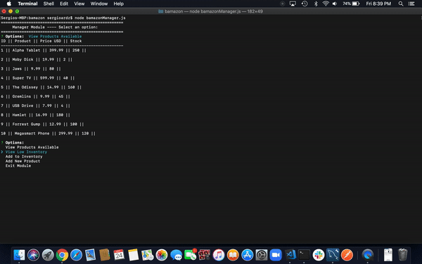
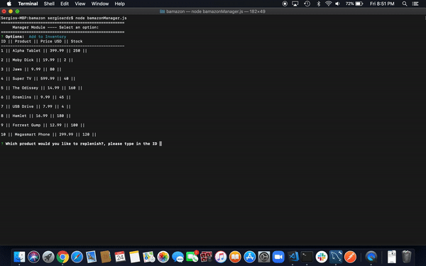
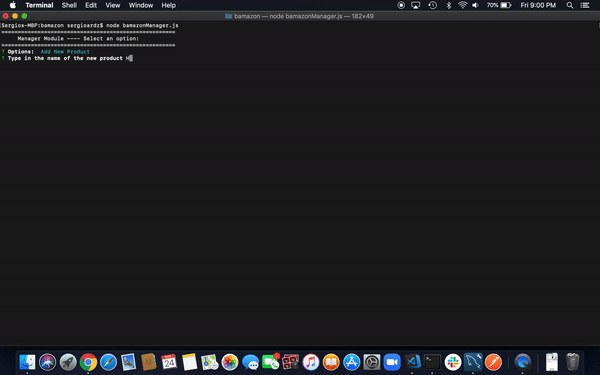

# BAMAZON
CLI App - node.js and mysql databases

### Overview
Bamazon is an Amazon-like storefront. The app will take in orders from customers and deplete stock from the store's inventory. As a bonus task, you can program your app to track product sales across your store's departments and then provide a summary of the highest-grossing departments in the store.

      
      
      
      

### BAMAZON Specifics - What the project does

From a Database, Bamazon is a storefront. There you as a customer you can decide which products buy and as a Manager you can review the stock and even add new products to the store.

### BAMAZON's Purpose - Why the project is useful
From a developer standpoint, BAMAZON wraps and reinforce the concepts learned during week 12 related to MySQL Databes using node.js

From the Customer standpoint, BAMAZON allows you to shop your favorite products, what is more fun than buying stuff?
From the Manager standpoint, BAMAZON let you keep track of your stock so you can replenish on time and you can always bring more interesting products to the store.

### BAMAZON for dummies - How users can get started with the project
Feel free to clone the repo and make sure you install the related node packages included in the package.json file. The SQL Scripts are also available to start with.
Once this is done, just start using the CLI app by entering any of the following commands preceded by "node: "
    * bamazonCustomer.js  
    * bamazonManager.js  

### How does BAMAZON works? - Where users can get help with your project
Feel free to explore my code and do not forget to read the documentation on the different packages installed.

### Who is the main artist here - Who maintains and contributes to the project
That would be me: Sergio Rodriguez  
Feel free to contact me through Github!

